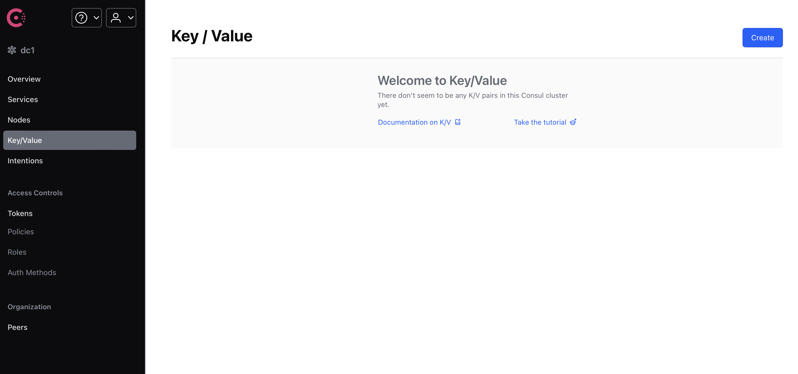
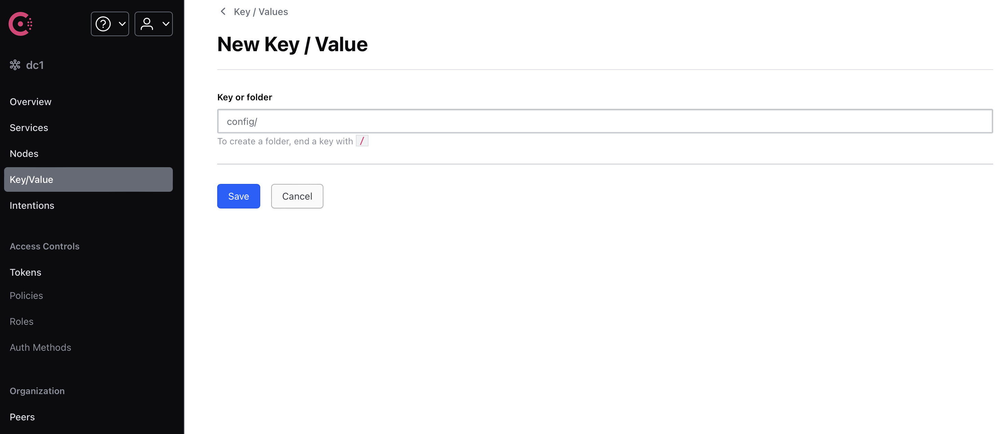
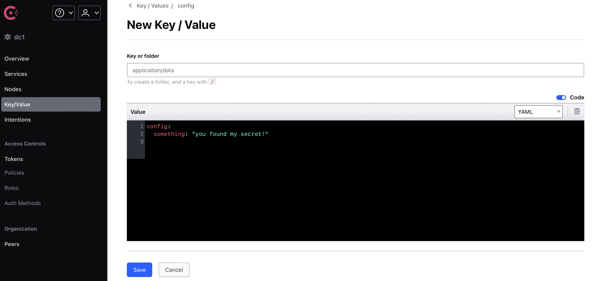

# Spring Cloud 速成 Ch4 Consul 配置管理

上一部分介绍了如何使用 Consul 作为服务注册中心，本部分将介绍如何使用 Consul 作为配置中心。

注意，Consul 使用 docker 部署时，默认配置文件会在容器重启时丢失。

## bootstrap.yml

`application.yml` 是 Spring Boot 的默认配置文件，而 `bootstrap.yml` 是 Spring Cloud 的默认配置文件。Spring Cloud 会先加载 `bootstrap.yml`，然后再加载 `application.yml`。因此，`application.yml` 中的配置会覆盖 `bootstrap.yml` 中的配置。

要开启`bootstrap.yml`功能，需要引入`spring-cloud-starter-bootstrap`依赖。

Spring Cloud 又引入一个`bootstrap.yml`配置文件的原因是，有些属性是在应用程序启动之前就要加载的，比如配置中心的配置信息。而 `bootstrap.yml` 就是用来加载这些配置的。正如它的名字一样，`bootstrap.yml` 是应用程序的“引导”配置文件，它先被加载，然后再靠它中服务的配置中心获取配置信息。因此，项目的配置便是由这三部分共同构成的。

复习一下 Spring Boot 的优先级顺序，

1. 命令行参数
2. application.properties或application.yml（在config子目录或当前目录）
3. application.properties或application.yml（在类路径的根目录）
4. 通过@PropertySource注解加载的属性文件
5. 默认属性（通过SpringApplication.setDefaultProperties指定）

在 Spring Cloud 中，对于第三条，可以细化为，

1. 本地的`application.yml`或`application.properties`
2. 远程的配置
3. 本地的`bootstrap.yml`或`bootstrap.properties`

由上面的介绍我们不难看出，我们应该把与连接配置中心相关的配置放在`bootstrap.yml`中，而把其他的配置放在`application.yml`或 Consul 中。

```yaml
spring:
  application:
    name: payment-service
  cloud:
    consul:
      host: 0.0.0.0
      port: 8500
      discovery:
        service-name: ${spring.application.name}
      config:
        profile-separator: "::"
        format: yaml
```

这里的 profile-separator 我们后面会讲到，它默认是一个逗号，但是文件名有逗号这点对我而言就很怪，所以我改成了双冒号。

其他的部分，例如数据库连接，应当留在`application.yml`中。

## Spring 配置文件 profile

Spring 的配置文件不止是这点知识，我们还要了解 profile。profile 是 Spring 用来解决不同环境下配置不同的问题的。例如，开发环境和生产环境的数据库连接信息是不同的，这时候就可以使用 profile 来解决这个问题。

例如，我们可以在`application.yml`中这样配置，

```yaml
spring:
  profiles:
    active: dev
```

`application.yml`会被加载，然后根据`spring.profiles.active`的值，加载`application-dev.yml`。

bootstrap 也是同理的。

## 使用 Consul 作为配置中心

要用 Consul 作为配置中心，我们需要引入`spring-cloud-starter-consul-config`依赖。

```groovy
implementation 'org.springframework.cloud:spring-cloud-starter-consul-config'
```

我们先为 payment 服务做一个临时的 API 用于测试，例如，

```java
@RestController
public class TestController {
    @Value("${config.info}")
    private String configInfo;

    @GetMapping("/config/info")
    public ResponseWrapper<String> getConfigInfo() {
        return configInfo;
    }
}
```

然后在 Consul 中添加一个配置。Consul 的文件存储在 KV 中。

根据[文档](https://docs.spring.io/spring-cloud-consul/reference/config.html)，在 KV 存储中，配置文件的路径应该在文件`config/<服务名><分隔符><profile>/data`下，其中这个分隔符默认是`,`，但我们前面配置成了双冒号。

这个文件夹还可以是，

1. `config/<服务名><分隔符><profile>/data`
2. `config/<服务名>/data`
3. `config/application<分隔符><profile>/data`
4. `config/application/data`

满足越多条件的文件夹优先级越高。例如，`config/payment-service/data`优先级高于`config/application/data`。这里的 profile 和前面介绍的相同。



选择 Create 创建文件或文件夹。注意，如果创建文件夹，名字后面加上`/`，否则会被当作文件名。加上`/`后，可以发现下面的 Value 框消失了。



然后我们根据上面所述，创建`config/application/data`文件，在里面添加`config.info`的值。



然后，我们配置`@RefreshScope`注解。这个注解要加载`@Configuration`类上，这样 Spring 才会知道这个类是需要刷新的。这里我们加在之前的`TestController`上。

这样当配置中心的配置发生变化时，我们的服务也会自动刷新。这个刷新的频率也是可以配置的，在 bootstrap 里改。

```yml
spring:
  cloud:
    consul:
      config:
        profile-separator: "::"
        format: yaml
        watch:
          wait-time: 1
```

默认 55 秒，这里改成 1 秒。

现在我们可以测试了。


